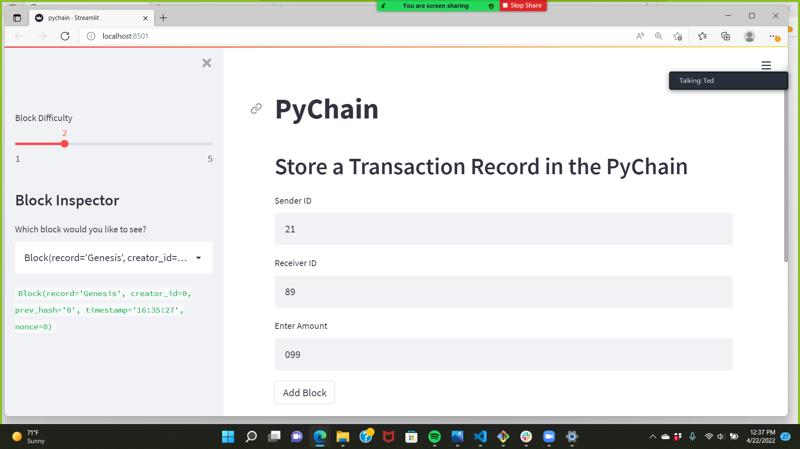
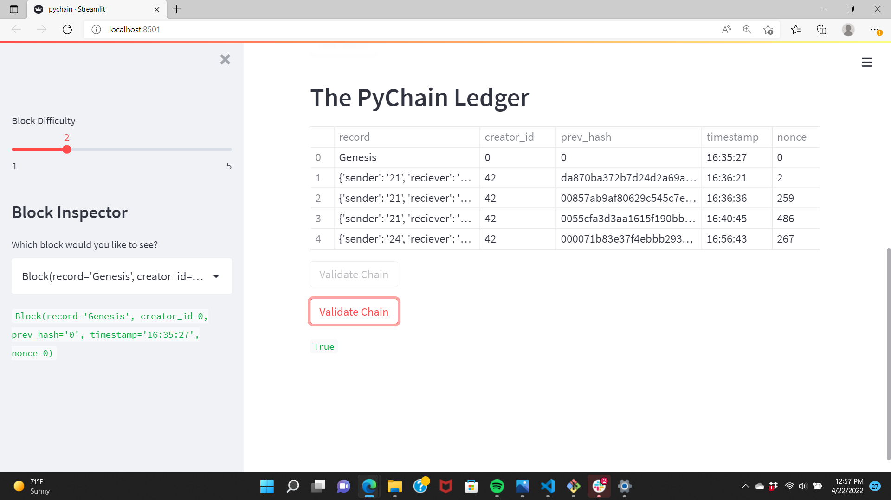
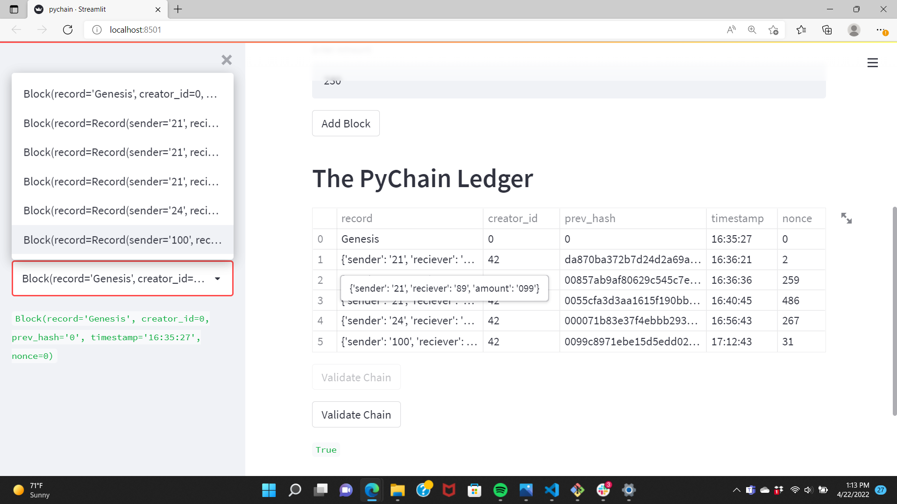

**Project Title Blockchain-Based Ledger System**

Technologies The code is written in Python 3.7.
The Blockchain is avaliable on Streamlit.

**Installation Guide**

import streamlit as st
from dataclasses import dataclass
from typing import Any, List
import datetime as datetime
import pandas as pd
import hashlib

**1. Created a Record Data Class**

**2. Modified the Existing Block Data                   Class to store Record Data**

**3. Created Streamlit interface**

**4. Test Streamlit interface**

**Contributors**

In addtion to me the GW Bootcamp TA, LA, and tutors help me create this project

**License**

The Source code is for educational purposes only and should not be used to make any professional recomendations. Feel free to use for any educational needs